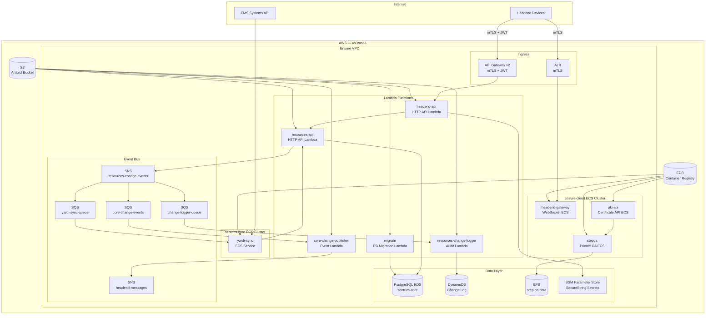
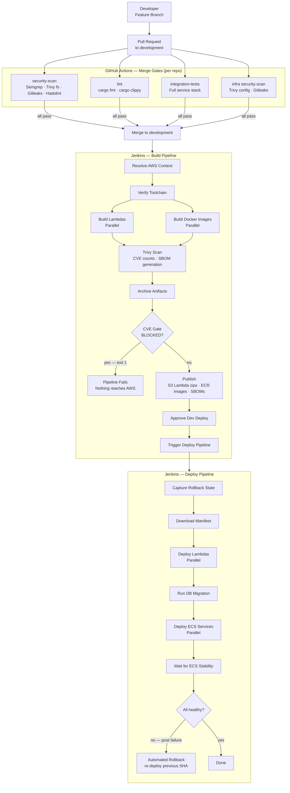

# Sentrics — Ensure Event Sync Platform

An event-driven platform built on AWS that synchronises senior living community data between the Sentrics core system and the Ensure Cloud headend network. The platform is designed around a DevSecOps pipeline where security is a gate, not an afterthought — compromised artifacts never reach AWS.

---

## Platform Overview

The system is split into two independently deployed stacks that communicate through SNS/SQS:

| Stack | Purpose |
|-------|---------|
| **sentrics-core** | Manages communities, locations, and residents. Exposes a public REST API and an internal IAM-authenticated API. Synchronises data from Yardi EHR. |
| **ensure-cloud** | Serves headend devices over mTLS. Issues device certificates via a private CA. Forwards core change events to connected headend communities. |

---

## Architecture



---

## DevSecOps Pipeline

Security is enforced at two layers — GitHub Actions gates code before it can merge, Jenkins gates artifacts before they can reach AWS.



---

## Security Controls

| Control | Tool | Where |
|---------|------|--------|
| SAST | Semgrep (security-audit, OWASP Top 10, Rust) | GitHub Actions |
| Secret scanning | Gitleaks v8 | GitHub Actions + infra gate |
| Dockerfile linting | Hadolint | GitHub Actions |
| Dependency / fs scanning | Trivy | GitHub Actions + Jenkins |
| Container image scanning | Trivy | Jenkins |
| IaC misconfiguration scanning | Trivy config | GitHub Actions infra gate |
| CVE threshold enforcement | Trivy + Jenkins gate | Jenkins — blocks publish |
| SBOM generation | Trivy CycloneDX | Jenkins — stored in S3 per build |
| Database credentials | AWS SSM SecureString | Never in env vars or logs |
| Container runtime | Distroless + non-root UID 65532 | All Docker images |
| Network auth | mTLS on ALB and API Gateway v2 | AWS ingress |
| IAM | Least-privilege per Lambda/ECS task | Terraform |
| Runtime security | AWS GuardDuty — ECS Fargate agent + Lambda network logs | AWS — HIGH/CRITICAL findings → SNS |
| Automated rollback | Re-deploy previous artifact SHA on any deploy failure | Jenkins deploy pipeline |

---

## Repository Structure

```
.
├── Jenkinsfile                  # Main build pipeline
├── Jenkinsfile.dev-deploy       # Dev deployment pipeline
├── Jenkinsfile.infra            # Terraform plan/apply pipeline
│
├── sentrics-core/               # Core platform services (separate repo)
│   ├── resources-api/           # REST API Lambda (Rust)
│   ├── resources-change-logger/ # Audit Lambda (Rust)
│   ├── yardi-sync/              # Yardi EHR sync ECS service (Rust)
│   ├── infra/                   # Local Docker Compose stack
│   └── scripts/                 # CI scripts and dev tooling
│
├── ensure-cloud/                # Ensure Cloud services (separate repo)
│   ├── headend-api/             # Headend HTTP API Lambda (Rust)
│   ├── headend-gateway/         # WebSocket gateway ECS service (Rust)
│   ├── core-change-publisher/   # Event publisher Lambda (Rust)
│   ├── pki/                     # Certificate API + step-ca (Rust + Docker)
│   ├── infra/                   # Local Docker Compose stack
│   └── scripts/                 # CI scripts and dev tooling
│
├── infra/                       # Terraform IaC — both stacks, single state
│   └── iac/
│
└── scripts/                     # Infra repo CI scripts and Jenkins agent setup
    ├── check.sh
    ├── common.sh
    ├── ci/
    │   ├── prereqs.sh
    │   └── security.sh
    └── jenkins/
        └── setup-jenkins-agent.sh
```

---

## Tech Stack

| Layer | Technology |
|-------|-----------|
| Language | Rust 1.93.0 (Lambdas + ECS services) |
| Lambda runtime | AWS Lambda on ARM64 (`provided.al2023`) |
| Container runtime | Distroless `cc-debian13:nonroot` |
| Infrastructure | Terraform ≥ 1.7 / AWS provider ≥ 5.0 |
| Database | PostgreSQL 16 on RDS |
| Messaging | AWS SNS + SQS |
| Event store | DynamoDB |
| Container registry | Amazon ECR |
| CI/CD | Jenkins (build + deploy) + GitHub Actions (security gates) |
| Local AWS emulation | LocalStack 4.x |
| Certificate authority | step-ca 0.30 |

---

## Local Development

Each stack has its own local environment driven by Docker Compose. See the individual READMEs for full setup instructions:

- [sentrics-core/README.md](sentrics-core/README.md)
- [ensure-cloud/README.md](ensure-cloud/README.md)

**Prerequisites:**
- Docker + Docker Compose
- Rust 1.93.0 (`rustup toolchain install 1.93.0`)
- cargo-lambda 1.9.1 (`cargo install cargo-lambda --locked --version 1.9.1`)

**Run pre-merge gates locally (from each repo root):**
```bash
./scripts/check.sh all       # security + lint + integration tests
./scripts/check.sh security  # security scan only
./scripts/check.sh lint      # clippy + rustfmt only
./scripts/check.sh test      # integration tests only
```

---

## Infrastructure Deployment

See [infra/README.md](infra/README.md) for Terraform setup, backend configuration, and how to run plan/apply via the Jenkins infra pipeline.
